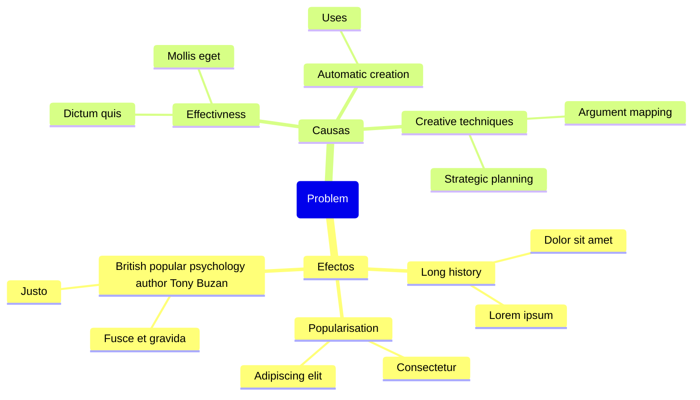
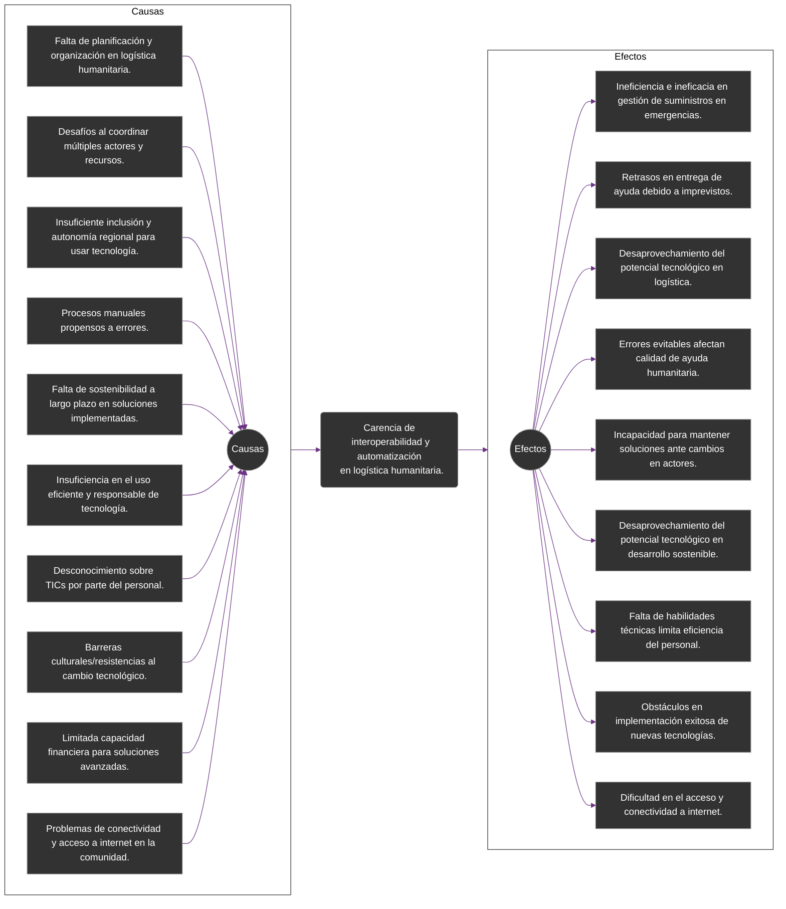
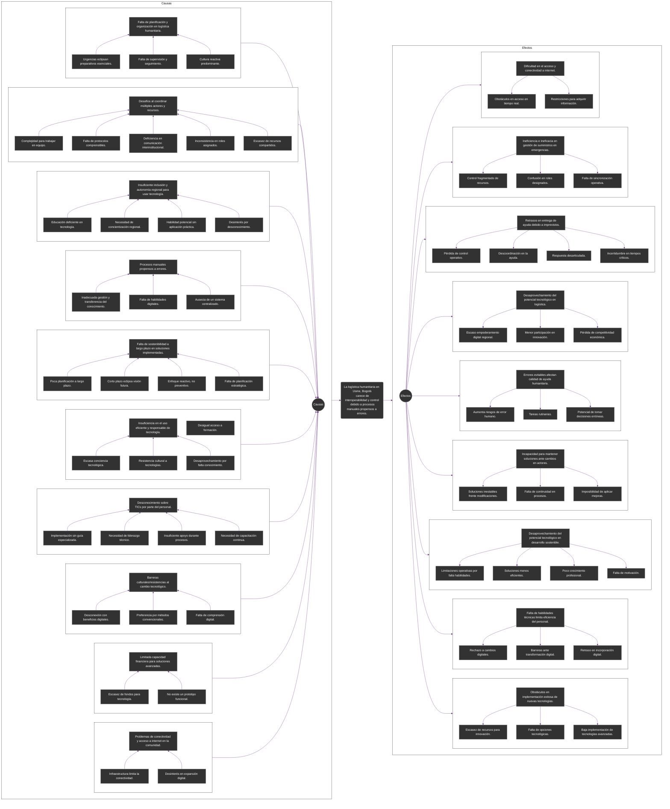

Necesito que organices la siguiente información para tener un árbol de problema, tienes criterio para reordenar y modificar la información. Usa todo tu conocimiento para generar la mejor solución de acuerdo a los componentes del árbol de problema. No debes modificar la situación problema. Te proporcionaré la situación problema junto a la lista de causas y efectos tanto directos como indirectos. Tu tarea es organizar la información de la mejor manera posible, relacionando la lista de causas y efectos indirectos con las causas y efectos directos.
Si haces un buen trabajo se te recompensará con un pago de 100 USD.

Situación problema:
Aumento de las quejas y reclamos hechas por los clientes.

Causas directas:
Deficiente servicio de postventa.
Mala calidad de los productos.
Aumento del precio de los productos.

Causas indirectas:
Capacitación insuficiente del personal.
Mala actitud del personal.
El producto se daña muy rápido.
Funcionamiento inadecuado del producto.
No hay suficiente productividad.
Aumento del precio de la materia prima.

Efectos directos:
Disminución de las compras hechas por los clientes.
Perdida de la imagen de la compañía.
Fortalecimiento de la competencia.

Efectos indirectos:
Perdida de utilidades.
Disminución de la participación en el mercado.
Perdida de motivación de la mano de obra.

Causas:

Deficiente servicio de postventa.
- Capacitación insuficiente del personal.
- Mala actitud del personal.

Mala calidad de los productos.
- El producto se daña muy rápido.
- Funcionamiento inadecuado del producto.

Aumento del precio de los productos.
- No hay suficiente productividad.
- Aumento del precio de la materia prima.

Efectos:

Disminución de las compras hechas por los clientes.
- Perdida de utilidades.
- Disminución de la participación en el mercado.

Perdida de la imagen de la compañía.
- Disminución de la participación en el mercado.
- Perdida de motivación de la mano de obra.

Fortalecimiento de la competencia.
- Perdida de utilidades.
- Perdida de motivación de la mano de obra.

Situación problema: 
La logística humanitaria en la localidad de Usme, Bogotá, Colombia, se encuentra desorganizada y es ineficiente. Hay procesos manuales y repetitivos propensos a errores que afectan la calidad de la ayuda entregada o directamente sin control ni historial de los procesos. Además, existe una falta de planificación y organización en el manejo de los recursos. 

Causas Directas:

Falta de planificación y organización en la logística humanitaria.
Desafío al coordinar y controlar múltiples actores y recursos para implementar soluciones efectivas.
Insuficiente inclusión social y autonomía regional a través del conocimiento para el uso eficiente y responsable del recurso tecnológico disponible.
Procesos manuales y repetitivos propensos al error humano.
Ausencia de sostenibilidad a largo plazo en las soluciones implementadas hasta ahora.
Insuficiencia en la utilización eficiente y responsable del recurso tecnológico disponible.
Desconocimiento sobre las TICs por parte del personal encargado.
Barreras culturales o resistencias al cambio hacia nuevas formas digitales/tecnológicas.
Limitada capacidad financiera para invertir en soluciones tecnológicas avanzadas.
Problemas de conectividad y acceso a internet en la comunidad.

Resumen:
Falta de planificación y organización en logística humanitaria.
Desafíos al coordinar múltiples actores y recursos.
Insuficiente inclusión y autonomía regional para usar tecnología.
Procesos manuales propensos a errores.
Falta de sostenibilidad a largo plazo en soluciones implementadas.
Insuficiencia en el uso eficiente y responsable de tecnología.
Desconocimiento sobre TICs por parte del personal.
Barreras culturales/resistencias al cambio tecnológico.
Limitada capacidad financiera para soluciones avanzadas.
Problemas de conectividad y acceso a internet en la comunidad.

Causas Indirectas:

Falta de conciencia sobre la importancia de la planificación y organización en la logística humanitaria.
Desafíos estructurales en la coordinación de actores y recursos en situaciones de emergencia.
Brechas en la educación y conciencia comunitaria sobre el uso eficiente de la tecnología.
Falta de capacitación y supervisión en la implementación de procesos logísticos.
Falta de enfoque en la sostenibilidad a largo plazo en las estrategias de implementación.
Brechas en la educación sobre tecnologías de la información y comunicación.
Resistencia cultural al cambio y a la adopción de nuevas tecnologías.
Restricciones económicas que limitan la inversión en soluciones tecnológicas.
Infraestructura deficiente de conectividad en la comunidad.

Efectos Directos:

Ineficiencia e ineficacia en la gestión actual del suministro y distribución de recursos durante situaciones de emergencias.
Retrasos en la entrega de ayuda humanitaria debido a situaciones imprevistas o pérdida de control sobre el proceso.
Desaprovechamiento del potencial tecnológico para mejorar los procesos logísticos.
Errores fácilmente evitables que afectan la calidad de la ayuda humanitaria.
Incapacidad para mantener las soluciones implementadas cuando los actores involucrados cambian o se retiran.
Desaprovechamiento del potencial tecnológico para mejorar los procesos logísticos y promover el desarrollo sostenible.
Falta de habilidades técnicas en el personal encargado, lo que limita la eficiencia y efectividad de las operaciones.
Obstáculo en la implementación exitosa de nuevas tecnologías o métodos digitales.
Restricción de las opciones disponibles para mejorar los sistemas actuales.
Dificultad en el acceso a información en tiempo real de internet.

Resumen:
Ineficiencia e ineficacia en gestión de suministros en emergencias.
Retrasos en entrega de ayuda debido a imprevistos.
Desaprovechamiento del potencial tecnológico en logística.
Errores evitables afectan calidad de ayuda humanitaria.
Incapacidad para mantener soluciones ante cambios en actores.
Desaprovechamiento del potencial tecnológico en desarrollo sostenible.
Falta de habilidades técnicas limita eficiencia del personal.
Obstáculos en implementación exitosa de nuevas tecnologías.
Restricción de opciones para mejorar sistemas actuales.
Dificultad en acceso a información en tiempo real de internet.

Efectos Indirectos:

Desafíos en la coordinación y control de múltiples actores y recursos para implementar soluciones efectivas.
Insuficiente inclusión social y autonomía regional a través del conocimiento para el uso eficiente y responsable del recurso tecnológico disponible.
Ausencia de sostenibilidad a largo plazo en las soluciones implementadas hasta ahora.
Procesos manuales y repetitivos propensos al error humano.
Desconocimiento sobre las TICs por parte del personal encargado.
Barreras culturales o resistencias al cambio hacia nuevas formas digitales/tecnológicas.
Limitada capacidad financiera para invertir en soluciones tecnológicas avanzadas.
Problemas de conectividad y acceso a internet en la comunidad.

Efectos:

Ineficiencia e ineficacia en gestión de suministros en emergencias.
-> Control fragmentado de recursos.
-> Confusión en roles designados.
-> Falta de sincronización operativa.

Retrasos en entrega de ayuda debido a imprevistos.
-> Pérdida de control operativo.
-> Descoordinación en la ayuda.
-> Respuesta desarticulada.
-> Incertidumbre en tiempos críticos.

Desaprovechamiento del potencial tecnológico en logística.
-> Escaso empoderamiento digital regional.
-> Menor participación en innovación.
-> Pérdida de competitividad económica.

Errores evitables afectan calidad de ayuda humanitaria.
-> Aumenta riesgos de error humano.
-> Tareas rutinarias.
-> Potencial de tomar decisiones erróneas.

Incapacidad para mantener soluciones ante cambios en actores.
-> Soluciones inestables frente modificaciones.
-> Falta de continuidad en procesos.
-> Imposibilidad de aplicar mejoras.

Desaprovechamiento del potencial tecnológico en desarrollo sostenible.
-> Limitaciones operativas por falta habilidades.
-> Soluciones menos eficientes.
-> Poco crecimiento profesional.
-> Falta de motivación.

Falta de habilidades técnicas limita eficiencia del personal.
-> Rechazo a cambios digitales.
-> Barreras ante transformación digital.
-> Retraso en incorporación digital.

Obstáculos en implementación exitosa de nuevas tecnologías.
-> Escasez de recursos para innovación.
-> Falta de opciones tecnológicas.
-> Baja implementación de tecnologías avanzadas.

Restricción de opciones para mejorar sistemas actuales.
-> Obstáculos en acceso en tiempo real.
-> Restricciones para adquirir información.

Situación problema: 
La logística humanitaria en la localidad de Usme, Bogotá, Colombia, se encuentra desorganizada y es ineficiente. Hay procesos manuales y repetitivos propensos a errores que afectan la calidad de la ayuda entregada o directamente sin control ni historial de los procesos. Además, existe una falta de planificación y organización en el manejo de los recursos.

Causas:

Falta de planificación y organización en logística humanitaria.
-> Urgencias eclipsan preparativos esenciales.
-> Falta de supervisión y seguimiento.
-> Cultura reactiva predominante.

Desafíos al coordinar múltiples actores y recursos.
-> Complejidad para trabajar en equipo.
-> Falta de protocolos comprensibles.
-> Deficiencia en comunicación interinstitucional.
-> Inconsistencia en roles asignados.
-> Escasez de recursos compartidos.

Insuficiente inclusión y autonomía regional para usar tecnología.
-> Educación deficiente en tecnología.
-> Necesidad de concientización regional.
-> Habilidad potencial sin aplicación práctica.
-> Desinterés por desconocimiento.

Procesos manuales propensos a errores.
-> Inadecuada gestión y transferencia del conocimiento.
-> Falta de habilidades digitales.
-> Ausecia de un sistema centralizado.

Falta de sostenibilidad a largo plazo en soluciones implementadas.
-> Poca planificación a largo plazo.
-> Corto plazo eclipsa visión futura.
-> Enfoque reactivo, no preventivo.
-> Falta de planificación estratégica.

Insuficiencia en el uso eficiente y responsable de tecnología.
-> Escasa conciencia tecnológica.
-> Resistencia cultural a tecnologías.
-> Desigual acceso a formación.
-> Desaprovechamiento por falta conocimiento.

Desconocimiento sobre TICs por parte del personal.
-> Implementación sin guía especializada.
-> Necesidad de liderazgo técnico.
-> Insuficiente apoyo durante procesos.
-> Necesidad de capacitación continua.

Barreras culturales/resistencias al cambio tecnológico.
-> Desconexión con beneficios digitales.
-> Preferencia por métodos convencionales.
-> Falta de comprensión digital.

Limitada capacidad financiera para soluciones avanzadas.
-> Escasez de fondos para tecnología.
-> No existe un prototipo funcional.

Problemas de conectividad y acceso a internet en la comunidad.
-> Infraestructura limita la conectividad.
-> Desinterés en expansión digital.

Un árbol de problemas es una herramienta gráfica utilizada en el análisis de problemas y la planificación de soluciones. Su objetivo principal es descomponer un problema complejo en sus componentes más simples y comprender la relación entre ellos. A continuación, encontrarás un árbol de problema con efectos, problema y causas.
Para las causas y efectos verás una jerarquía indicada con el símbolo (->)

Deberás escribir el código mermaid para un mindmap que represente el árbol del problema, a continuación encontraras un ejemplo del código mermaid y luego la información del árbol del problema que deberás representan como un mindmap.

Efectos:

Ineficiencia e ineficacia en gestión de suministros en emergencias.
-> Control fragmentado de recursos.
-> Confusión en roles designados.
-> Falta de sincronización operativa.

Retrasos en entrega de ayuda debido a imprevistos.
-> Pérdida de control operativo.
-> Descoordinación en la ayuda.
-> Respuesta desarticulada.
-> Incertidumbre en tiempos críticos.

Desaprovechamiento del potencial tecnológico en logística.
-> Escaso empoderamiento digital regional.
-> Menor participación en innovación.
-> Pérdida de competitividad económica.

Errores evitables afectan calidad de ayuda humanitaria.
-> Aumenta riesgos de error humano.
-> Tareas rutinarias.
-> Potencial de tomar decisiones erróneas.

Incapacidad para mantener soluciones ante cambios en actores.
-> Soluciones inestables frente modificaciones.
-> Falta de continuidad en procesos.
-> Imposibilidad de aplicar mejoras.

Desaprovechamiento del potencial tecnológico en desarrollo sostenible.
-> Limitaciones operativas por falta habilidades.
-> Soluciones menos eficientes.
-> Poco crecimiento profesional.
-> Falta de motivación.

Falta de habilidades técnicas limita eficiencia del personal.
-> Rechazo a cambios digitales.
-> Barreras ante transformación digital.
-> Retraso en incorporación digital.

Obstáculos en implementación exitosa de nuevas tecnologías.
-> Escasez de recursos para innovación.
-> Falta de opciones tecnológicas.
-> Baja implementación de tecnologías avanzadas.

Dificultad en el acceso a información en tiempo real de internet.
-> Obstáculos en acceso en tiempo real.
-> Restricciones para adquirir información.

Situación problema: 
La logística humanitaria en la localidad de Usme, Bogotá, Colombia, presenta desafíos en términos de organización y eficiencia. Hay procesos manuales y repetitivos propensos a errores que afectan la calidad de la ayuda entregada o directamente sin control ni historial de los procesos. Además, existe una falta de planificación y organización en el manejo de los recursos.

La logística humanitaria en Usme, Bogotá carece de interoperabilidad y control debido a procesos manuales propensos a errores.

Carencia de interoperabilidad y automatización en logística humanitaria.

Causas:

Falta de planificación y organización en logística humanitaria.
-> Urgencias eclipsan preparativos esenciales.
-> Falta de supervisión y seguimiento.
-> Cultura reactiva predominante.

Desafíos al coordinar múltiples actores y recursos.
-> Complejidad para trabajar en equipo.
-> Falta de protocolos comprensibles.
-> Deficiencia en comunicación interinstitucional.
-> Inconsistencia en roles asignados.
-> Escasez de recursos compartidos.

Insuficiente inclusión y autonomía regional para usar tecnología.
-> Educación deficiente en tecnología.
-> Necesidad de concientización regional.
-> Habilidad potencial sin aplicación práctica.
-> Desinterés por desconocimiento.

Procesos manuales propensos a errores.
-> Inadecuada gestión y transferencia del conocimiento.
-> Falta de habilidades digitales.
-> Ausecia de un sistema centralizado.

Falta de sostenibilidad a largo plazo en soluciones implementadas.
-> Poca planificación a largo plazo.
-> Corto plazo eclipsa visión futura.
-> Enfoque reactivo, no preventivo.
-> Falta de planificación estratégica.

Insuficiencia en el uso eficiente y responsable de tecnología.
-> Escasa conciencia tecnológica.
-> Resistencia cultural a tecnologías.
-> Desigual acceso a formación.
-> Desaprovechamiento por falta conocimiento.

Desconocimiento sobre TICs por parte del personal.
-> Implementación sin guía especializada.
-> Necesidad de liderazgo técnico.
-> Insuficiente apoyo durante procesos.
-> Necesidad de capacitación continua.

Barreras culturales/resistencias al cambio tecnológico.
-> Desconexión con beneficios digitales.
-> Preferencia por métodos convencionales.
-> Falta de comprensión digital.

Limitada capacidad financiera para soluciones avanzadas.
-> Escasez de fondos para tecnología.
-> No existe un prototipo funcional.

Problemas de conectividad y acceso a internet en la comunidad.
-> Infraestructura limita la conectividad.
-> Desinterés en expansión digital.

Arbol del problema simplificado:

Arbol del problema extendido:
